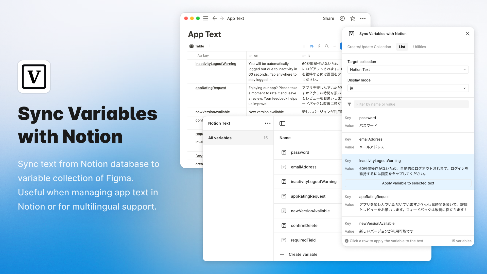

# Sync Variables with Notion (Figma Plugin)

Synchronizes variables from a Notion database to a Figma document's Variable Collection.
This is particularly useful for managing application text in Notion or supporting multiple languages.

## 🔥 How to use

### Sync collection tab
Connects a Notion database to a Figma Variable Collection and synchronizes their values. Settings are saved per Figma document.

#### 1. Database ID
Specify the Notion database ID ([Reference](https://developers.notion.com/reference/retrieve-a-database)).

#### 2. Integration token
First, create a new integration in Notion ([Reference](https://developers.notion.com/docs/create-a-notion-integration#create-your-integration-in-notion)).
Next, grant your integration page permissions ([Reference](https://developers.notion.com/docs/create-a-notion-integration#give-your-integration-page-permissions)).
Enter the copied token.

#### 3. Key property name
Specify the name of the Notion property that serves as the unique key for the variables (e.g., `Name`, `Key`, `ID`).
Currently, `title`, `formula`, and `text` properties are supported as keys.

#### 4. Collection name to create or update
Specify the name of the Figma Variable Collection to sync with. Existing local collection names will be suggested via autocomplete. If the specified collection doesn't exist, it will be created.

#### 5. Add or reorder modes
Specify the Notion property names that correspond to Figma Variable Modes. These properties will hold the variable values for each mode (e.g., language).

- **Adding modes**:
  1. Enter a mode name in the textbox (e.g., `ja`, `en`, or other property names in your Notion database).
  2. Click the "Add" button to add it to the list.
- **Reordering modes**: Modes in the list can be reordered via drag and drop. This order will be reflected in the order of Figma variable modes.
- **Removing modes**: Click the X icon to the right of each mode name to remove that mode from the list.

After entering the information for steps 1-4, click the "Sync variable collection with Notion" button to start the synchronization. This process might take some time depending on the number of items in the database and the variables.

### List tab
#### About list tab
Displays variables from the **selected** Collection. Only **STRING** type variables applicable to **TEXT_CONTENT** are shown. You can copy keys and values, and filter the list by key or value.
Clicking on a row reveals the button described below.

##### "Apply variable to selected text" button
Select text layers in Figma and click the button to apply the variable.

#### Display mode
Select the Variable Mode (e.g., language) to display its corresponding values in the list.

#### About caching
When the target collection is a library collection, this plugin caches its information in client storage.
This is done because fetching library collections with many variables can be time-consuming and might hit Figma's API rate limits.
Clicking the "Refresh" button clears the cache and fetches the latest variable data.

### Utilities tab
Provides several utility actions to help manage variables and their application to text layers.

#### Target collection
Select the Variable Collection to target for the actions. You can choose a collection or all collections.

#### Target text range
Select the scope for the actions: "Selection", "Current page", or "All pages".
You can also choose whether to include text layers within components ("Include text within components") or instances ("Include text within instances") using the respective checkboxes.

#### Limit variable name
Optionally, enter text here to limit the "Bulk apply variables" action to only those variables whose names contain the specified text.

#### "Bulk apply variables" button
Automatically applies variables to text layers within the selected range. It matches text content with variable values across all modes in the target collection(s).

#### "Highlight applied variables" button
Visualizes variable usage on text layers. Text layers with variables applied are highlighted in blue, while those without are highlighted in red.

## 📮 Support

If you have any problems or feedback, please use the [GitHub Issues](https://github.com/ryonakae/figma-plugin-sync-variables-with-notion/issues).

---

This plugin was created by Ryo Nakae 🙎‍♂️.

- https://brdr.jp
- https://x.com/ryo_dg
- https://github.com/ryonakae